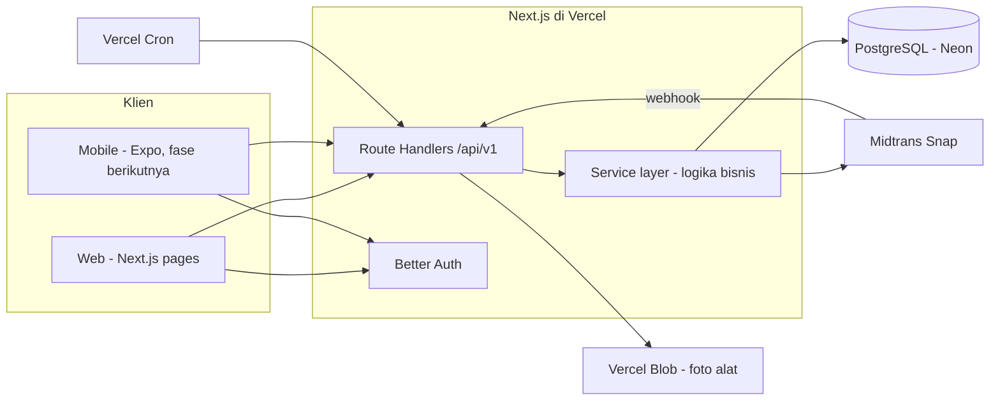
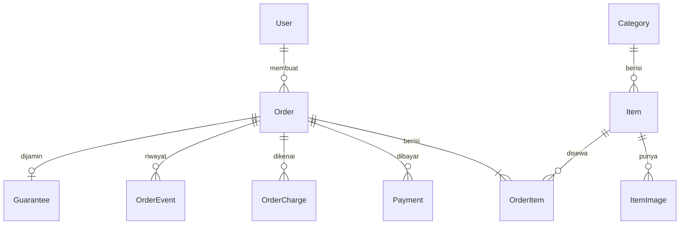
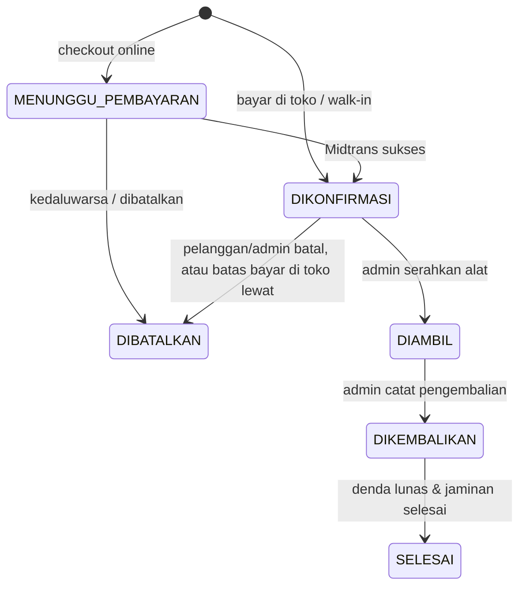
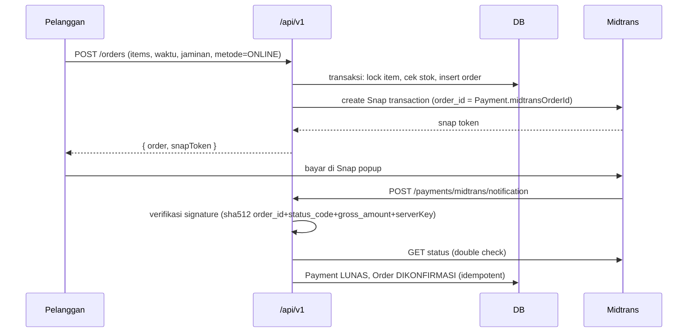

# Design: Web Aplikasi Penyewaan Alat Hiking

## 1. Ringkasan Arsitektur



Prinsip utama:
- **API-first.** Semua logika bisnis ada di service layer (`src/server/services`) dan dibuka lewat Route Handlers `/api/v1/*`. Halaman web memanggil service yang sama (langsung dari Server Components untuk baca data, lewat API untuk aksi), jadi mobile app nanti tidak butuh backend baru.
- **Logika murni terpisah.** Perhitungan biaya, hari sewa, denda, dan transisi status ditulis sebagai fungsi murni di `src/lib/domain`, tanpa akses database, supaya mudah diuji dan bisa dipakai bersama di mobile.
- **Satu sumber validasi.** Skema Zod di `src/lib/validation` dipakai form (react-hook-form), API, dan nanti mobile.

## 2. Techstack

| Layer | Pilihan |
|---|---|
| Framework | Next.js (App Router) + TypeScript |
| UI | Tailwind CSS + shadcn/ui, ikon lucide-react |
| Form | react-hook-form + Zod |
| Data fetching klien | TanStack Query |
| State keranjang | Zustand + persist (localStorage) |
| Database | PostgreSQL (Neon) |
| ORM | Prisma |
| Auth | Better Auth (email/password + Google), plugin admin untuk peran |
| Pembayaran | Midtrans Snap (sandbox saat pengembangan) |
| Penyimpanan foto | Vercel Blob |
| Tanggal & zona waktu | date-fns + @date-fns/tz (Asia/Jakarta) |
| Tes | Vitest (unit domain + integrasi service) |
| Deploy | Vercel + Neon, Vercel Cron |

## 3. Struktur Proyek

```
src/
  app/
    (public)/              # katalog, detail alat, halaman statis
      page.tsx             # homepage
      alat/page.tsx        # katalog
      alat/[slug]/page.tsx # detail alat
      keranjang/page.tsx   # publik: login baru diminta saat checkout (Req 1.3)
    (customer)/            # butuh login CUSTOMER
      checkout/page.tsx
      pesanan/page.tsx
      pesanan/[code]/page.tsx
    (auth)/masuk, daftar
    admin/                 # butuh ADMIN, layout sidebar
      page.tsx             # dashboard
      alat/, kategori/, pesanan/, pesanan/baru/ (walk-in),
      pelanggan/, pengaturan/
    api/
      auth/[...all]/route.ts   # Better Auth
      v1/...                   # REST API (lihat bagian 7)
  components/
    ui/                    # shadcn/ui
    catalog/, cart/, order/, admin/
  lib/
    domain/                # fungsi murni: pricing, fine, availability, order-status
    validation/            # skema Zod
    format.ts              # format Rupiah & tanggal WIB
  server/
    db.ts                  # Prisma client
    auth.ts                # konfigurasi Better Auth + helper requireRole
    services/              # item, category, order, payment, return, settings, dashboard
    midtrans.ts
prisma/
  schema.prisma
  seed.ts
```

## 4. Model Data

### 4.1 Diagram relasi



### 4.2 Skema Prisma (inti)

Tabel bawaan Better Auth (`Session`, `Account`, `Verification`) dibuat lewat CLI Better Auth dan tidak ditulis ulang di sini.

```prisma
enum Role { CUSTOMER ADMIN }
enum Visibility { PUBLIC INTERNAL }
enum OrderSource { ONLINE WALK_IN }
enum OrderStatus { MENUNGGU_PEMBAYARAN DIKONFIRMASI DIAMBIL DIKEMBALIKAN SELESAI DIBATALKAN }
enum PaymentMethod { ONLINE BAYAR_DI_TOKO }
enum PaymentStatus { MENUNGGU LUNAS GAGAL KEDALUWARSA }
enum PaymentPurpose { SEWA_DAN_DEPOSIT DENDA REFUND_DEPOSIT }
enum PaymentChannel { MIDTRANS TUNAI TRANSFER QRIS }
enum GuaranteeType { DEPOSIT KTP }
enum GuaranteeStatus { BELUM_DITERIMA DITERIMA DIKEMBALIKAN }
enum ChargeType { TELAT KERUSAKAN KEHILANGAN }

model User {
  id        String   @id
  name      String
  email     String   @unique
  phone     String?
  role      Role     @default(CUSTOMER)
  // field lain dari Better Auth (emailVerified, image, dst.)
  orders    Order[]
  createdAt DateTime @default(now())
}

model Category {
  id    String @id @default(cuid())
  name  String @unique
  slug  String @unique
  items Item[]
}

model Item {
  id            String     @id @default(cuid())
  name          String
  slug          String     @unique
  categoryId    String
  category      Category   @relation(fields: [categoryId], references: [id])
  description   String?
  specs         Json?      // { "Kapasitas": "2 orang", "Berat": "2.1 kg" }
  pricePerDay   Int        // Rupiah
  depositPerUnit Int       @default(0)
  stock         Int
  visibility    Visibility @default(PUBLIC)
  allowKtp      Boolean    @default(true)
  isActive      Boolean    @default(true)
  deletedAt     DateTime?
  images        ItemImage[]
  orderItems    OrderItem[]
  createdAt     DateTime   @default(now())
  updatedAt     DateTime   @updatedAt
  @@index([visibility, isActive])
}

model ItemImage {
  id     String @id @default(cuid())
  itemId String
  item   Item   @relation(fields: [itemId], references: [id], onDelete: Cascade)
  url    String
  order  Int    @default(0)
}

model Order {
  id              String        @id @default(cuid())
  code            String        @unique      // contoh: HK-260926-0001
  source          OrderSource
  userId          String?
  user            User?         @relation(fields: [userId], references: [id])
  customerName    String        // snapshot, wajib juga untuk tamu walk-in
  customerPhone   String
  startAt         DateTime      // waktu ambil (UTC)
  endAt           DateTime      // jatuh tempo (UTC)
  rentalDays      Int
  status          OrderStatus
  paymentMethod   PaymentMethod
  guaranteeType   GuaranteeType
  rentalSubtotal  Int
  depositTotal    Int           // 0 jika KTP
  // snapshot kebijakan
  graceHours      Int
  lateFinePercent Int
  // batas waktu
  paymentDueAt    DateTime?     // online: dibuat + N menit; bayar di toko: startAt - N jam
  pickedUpAt      DateTime?
  returnedAt      DateTime?
  completedAt     DateTime?
  cancelledAt     DateTime?
  cancelReason    String?
  note            String?
  items           OrderItem[]
  payments        Payment[]
  charges         OrderCharge[]
  events          OrderEvent[]
  guarantee       Guarantee?
  createdById     String?       // admin pembuat untuk walk-in
  createdAt       DateTime      @default(now())
  updatedAt       DateTime      @updatedAt
  @@index([status, startAt, endAt])
}

model OrderItem {
  id             String @id @default(cuid())
  orderId        String
  order          Order  @relation(fields: [orderId], references: [id], onDelete: Cascade)
  itemId         String
  item           Item   @relation(fields: [itemId], references: [id])
  itemName       String // snapshot
  quantity       Int
  pricePerDay    Int    // snapshot
  depositPerUnit Int    // snapshot
  lineTotal      Int
  @@index([itemId])
}

model Payment {
  id           String         @id @default(cuid())
  orderId      String
  order        Order          @relation(fields: [orderId], references: [id])
  purpose      PaymentPurpose
  channel      PaymentChannel
  amount       Int            // REFUND_DEPOSIT dicatat positif, arahnya dari purpose
  status       PaymentStatus
  midtransOrderId String?     @unique
  snapToken    String?
  rawNotification Json?
  paidAt       DateTime?
  recordedById String?        // admin untuk pembayaran manual
  createdAt    DateTime       @default(now())
}

model OrderCharge {
  id          String     @id @default(cuid())
  orderId     String
  order       Order      @relation(fields: [orderId], references: [id])
  type        ChargeType
  orderItemId String?
  amount      Int
  note        String?
  createdById String?
  createdAt   DateTime   @default(now())
}

model Guarantee {
  id           String          @id @default(cuid())
  orderId      String          @unique
  order        Order           @relation(fields: [orderId], references: [id])
  type         GuaranteeType
  status       GuaranteeStatus @default(BELUM_DITERIMA)
  receivedAt   DateTime?
  receivedById String?
  returnedAt   DateTime?
  returnedById String?
  // Sengaja TIDAK ada kolom nomor/foto KTP (Req 7.6)
}

model OrderEvent {
  id        String   @id @default(cuid())
  orderId   String
  order     Order    @relation(fields: [orderId], references: [id])
  actorId   String?  // null = sistem (cron/webhook)
  type      String   // STATUS_CHANGED, PAYMENT_RECORDED, GUARANTEE_RECEIVED, CHARGE_ADDED, ...
  data      Json?
  createdAt DateTime @default(now())
}

model Setting {
  id                       Int     @id @default(1) // baris tunggal
  graceHours               Int     @default(12)
  lateFinePercent          Int     @default(100)
  depositEnabled           Boolean @default(true)
  ktpEnabled               Boolean @default(true)
  onlinePaymentExpiryMin   Int     @default(60)
  payAtStoreCancelHours    Int     @default(24)
  openHour                 Int     @default(8)   // WIB
  closeHour                Int     @default(21)  // WIB
}
```

Catatan desain:
- **Deposit bukan pendapatan.** Deposit tercatat di `Order.depositTotal` dan di `Payment` bertujuan `SEWA_DAN_DEPOSIT`. Pengembalian sisa deposit dicatat sebagai `Payment` bertujuan `REFUND_DEPOSIT`. Dashboard menghitung pendapatan dari `rentalSubtotal` pesanan yang tidak dibatalkan + `OrderCharge`.
- **Snapshot** harga, nama alat, grace period, dan persentase denda ada di pesanan (Req 6.5, 10.5).
- **Guest walk-in** cukup `customerName` + `customerPhone` dengan `userId` kosong.
- **Implementasi aktual** ada di `prisma/schema.prisma`. Tambahan dibanding skema di atas:
  - Model Better Auth (`Session`, `Account`, `Verification`) ditulis langsung di skema. `role` dan `phone` di `User` akan didaftarkan sebagai `additionalFields` Better Auth (`role` dengan `input: false`, supaya pendaftaran publik tidak bisa memilih peran).
  - `OrderCodeCounter` (per hari WIB) untuk membuat kode `HK-YYMMDD-NNNN` secara atomik.
  - `OrderCharge.orderItemId` punya relasi ke `OrderItem`.
- **Lokal**: PostgreSQL 18 lewat `docker-compose.yml`, database `sewa_hiking` (dev) dan `sewa_hiking_test` (integration test).

## 5. Logika Domain (fungsi murni di `src/lib/domain`)

### 5.1 Hari sewa dan biaya (`pricing.ts`)

```ts
const HOUR = 3_600_000;

export function rentalDays(startAt: Date, endAt: Date): number {
  const hours = (endAt.getTime() - startAt.getTime()) / HOUR;
  if (hours <= 0) throw new DomainError("WAKTU_TIDAK_VALID");
  return Math.max(1, Math.ceil(hours / 24));
}

export function quote(lines: { pricePerDay: number; depositPerUnit: number; quantity: number }[],
                      days: number, guarantee: GuaranteeType) {
  const rentalSubtotal = lines.reduce((s, l) => s + l.pricePerDay * l.quantity * days, 0);
  const depositTotal = guarantee === "DEPOSIT"
    ? lines.reduce((s, l) => s + l.depositPerUnit * l.quantity, 0) : 0;
  return { rentalSubtotal, depositTotal, totalDue: rentalSubtotal + depositTotal };
}
```

### 5.2 Denda keterlambatan (`fine.ts`)

```ts
export function lateFine(p: {
  endAt: Date; returnedAt: Date; graceHours: number; lateFinePercent: number;
  lines: { pricePerDay: number; quantity: number }[];
}) {
  const lateHours = (p.returnedAt.getTime() - p.endAt.getTime()) / HOUR;
  if (lateHours <= p.graceHours) return { lateHours: Math.max(0, lateHours), lateDays: 0, amount: 0 };
  const lateDays = Math.ceil(lateHours / 24);          // dihitung dari jatuh tempo asli
  const perDay = p.lines.reduce((s, l) => s + l.pricePerDay * l.quantity, 0);
  const amount = Math.round(perDay * lateDays * p.lateFinePercent / 100);
  return { lateHours, lateDays, amount };
}
```

Kasus uji wajib (Req 10.6), jatuh tempo Minggu 10:00, Rp50.000 × 1:
| Kembali | Jam telat | Hari telat | Denda |
|---|---|---|---|
| Minggu 20:00 | 10 | 0 | 0 |
| Minggu 22:00 | 12 | 0 | 0 (batas inklusif) |
| Senin 09:00 | 23 | 1 | 50.000 |
| Senin 12:00 | 26 | 2 | 100.000 |

### 5.3 Penyelesaian jaminan (`settlement.ts`)

```ts
export function settle(guarantee: GuaranteeType, depositTotal: number, totalCharges: number) {
  if (guarantee === "KTP") return { refund: 0, amountToCollect: totalCharges };
  const refund = Math.max(0, depositTotal - totalCharges);
  const amountToCollect = Math.max(0, totalCharges - depositTotal);
  return { refund, amountToCollect };
}
```

### 5.4 Ketersediaan (`availability.ts` + query)

Dua rentang beririsan jika `a.start < b.end && b.start < a.end`.

Pesanan yang menahan stok:
- `DIKONFIRMASI`, `DIAMBIL`
- `MENUNGGU_PEMBAYARAN` dengan `paymentDueAt > now()`

Untuk `DIAMBIL`, akhir rentang efektif = `max(endAt, now())` (Req 5.3). Ini membuat alat yang telat kembali tidak dianggap tersedia.

Query (SQL mentah via Prisma, per daftar item):

```sql
SELECT oi."itemId", COALESCE(SUM(oi.quantity), 0) AS reserved
FROM "OrderItem" oi JOIN "Order" o ON o.id = oi."orderId"
WHERE oi."itemId" = ANY($1)
  AND o."startAt" < $3                                   -- requestedEnd
  AND (CASE WHEN o.status = 'DIAMBIL' THEN GREATEST(o."endAt", now()) ELSE o."endAt" END) > $2  -- requestedStart
  AND (o.status IN ('DIKONFIRMASI','DIAMBIL')
       OR (o.status = 'MENUNGGU_PEMBAYARAN' AND o."paymentDueAt" > now()))
GROUP BY oi."itemId";
```

`available = item.stock - reserved`.

**Implementasi aktual (Task 7, `src/server/services/availability.ts`)** berbeda dari SQL di atas dalam dua hal:
- **Puncak pemakaian, bukan jumlah total.** Pesanan yang beririsan diambil lewat Prisma, dipotong ke rentang yang diminta, lalu dihitung puncak pemakaian bersamaan dengan sweep line (`peakUsage`). Dua pesanan yang tidak saling bertemu di dalam rentang tidak dijumlahkan, jadi tidak ada penolakan yang sebenarnya muat.
- **Alat DIAMBIL yang lewat jatuh tempo menahan stok tanpa batas akhir** (`effectiveEnd` → `OPEN_ENDED`), bukan hanya sampai `now()`. Alat itu belum ada di toko, jadi unitnya tidak boleh dipesan untuk tanggal berapa pun sampai admin mencatat pengembalian. Dengan `max(endAt, now())`, pesanan untuk besok tetap diterima walau alatnya belum kembali.
- Filter "pesanan yang menahan stok" ada di satu tempat (`holdingOrderWhere`) dan dipakai juga oleh peringatan stok dan hapus alat.

### 5.5 Mencegah double booking (Req 5.4)

`createOrder` berjalan di dalam `prisma.$transaction`:
1. `SELECT id FROM "Item" WHERE id = ANY($1) ORDER BY id FOR UPDATE` — mengunci baris alat terkait (urutan tetap untuk mencegah deadlock).
2. Hitung ketersediaan dengan query 5.4.
3. Jika ada yang kurang → rollback, lempar `STOK_TIDAK_CUKUP` beserta detail alat.
4. Insert `Order`, `OrderItem`, `Guarantee`, `OrderEvent`.

Transaksi lain untuk alat yang sama menunggu sampai kunci dilepas, lalu melihat pesanan yang baru dibuat.

### 5.6 Mesin status pesanan (`order-status.ts`)



**Implementasi aktual (Task 12, `src/server/services/admin-orders.ts`)**:
- `outstandingCharges` dan `depositSettled` (dibutuhkan guard `DIKEMBALIKAN → SELESAI`, Task 14) dihitung dari `charges`/`payments` yang sudah ada, bukan disimpan sebagai kolom. `getAdminOrder` mengembalikan `availableActions` (dari `availableTransitions`) yang dipakai UI untuk menampilkan tombol aksi.
- Konsekuensi penting: tombol seperti "Serahkan Alat" **tidak dirender sama sekali** sebelum transisinya valid (lunas, dan KTP sudah diterima jika dipakai) — bukan dirender dalam keadaan nonaktif. Status yang menghalangi tetap terlihat lewat badge "Lunas"/"KTP · Belum Diterima" di panel Pembayaran & Jaminan.
- `recordManualPayment`: mencatat `Payment` LUNAS untuk `SEWA_DAN_DEPOSIT`/`DENDA`/`REFUND_DEPOSIT`; pesanan `MENUNGGU_PEMBAYARAN` yang baru lunas otomatis pindah ke `DIKONFIRMASI`.
- `updateGuaranteeStatus`: hanya untuk jaminan KTP; `RECEIVE` butuh status `BELUM_DITERIMA`, `RETURN` butuh `DITERIMA`.
- Semua aksi (`pickupOrder`, `cancelOrderByAdmin`, `recordManualPayment`) berjalan dalam transaksi dengan `SELECT ... FOR UPDATE` pada baris `Order`, dan mencatat `OrderEvent`.
- Halaman `/admin/pesanan` memakai form GET biasa untuk filter (status, sumber, metode, pencarian kode/nama/nomor HP), sehingga URL bisa dibagikan dan tetap jalan tanpa JavaScript.

**Implementasi aktual (Task 13, sewa walk-in)**:
- `services/items.ts`, `createQuickItem()`: dipanggil dari `POST /admin/items/quick`. Selalu memaksa `visibility: "INTERNAL"` di server terlepas dari input klien.
- `services/customers.ts`, `searchCustomers()`: cari pelanggan `role: CUSTOMER` berdasarkan nama/email/nomor HP, minimal 2 karakter, lewat `GET /admin/customers?q=`.
- `services/admin-orders.ts`, `createWalkInOrder()`: menerjemahkan pelanggan terdaftar/tamu jadi `userId`/`customerName`/`customerPhone`, lalu memanggil `createOrder` yang sama dengan checkout online (`source: "WALK_IN"`) sehingga aturan ketersediaan, biaya, dan jaminan identik. Jika `pickupNow`, berjalan berurutan: `recordManualPayment` → `updateGuaranteeStatus("RECEIVE")` (jika KTP) → `pickupOrder`, memakai fungsi yang sama dari Task 12.
- UI (`/admin/pesanan/baru`): `CustomerPicker` (radio terdaftar/tamu), `ItemPicker` (cari alat publik + internal, dengan dialog `QuickItemDialog`), lalu `WalkInForm` menghitung pratinjau biaya dan opsi jaminan di klien memakai fungsi domain murni yang sama (`quote`, `guaranteeOptions`) — server tetap menghitung ulang secara otoritatif saat submit.

Guard transisi:
| Transisi | Syarat |
|---|---|
| → `DIAMBIL` | Pembayaran `SEWA_DAN_DEPOSIT` sudah `LUNAS`; jika KTP, `Guarantee.status = DITERIMA` |
| → `DIKEMBALIKAN` | Mengisi `returnedAt`; sistem membuat `OrderCharge` TELAT otomatis jika > 0 |
| → `SELESAI` | Semua denda yang harus ditagih sudah lunas; deposit: refund tercatat (atau refund 0); KTP: `Guarantee.status = DIKEMBALIKAN` |
| → `DIBATALKAN` oleh pelanggan | Status `MENUNGGU_PEMBAYARAN`, atau `DIKONFIRMASI` dengan pembayaran belum lunas |

Pesanan online yang sudah lunas lalu dibatalkan butuh refund manual oleh admin (dicatat lewat catatan dan `Payment` refund). Pembatalan pesanan lunas hanya bisa oleh admin.

`assertTransition(from, to, ctx)` melempar `DomainError("TRANSISI_TIDAK_VALID")` jika tidak memenuhi. Setiap transisi mencatat `OrderEvent`.

Implementasi (`src/lib/domain/order-status.ts`) juga menentukan siapa pelakunya (`CUSTOMER`/`ADMIN`/`SYSTEM`):
- Serah alat, catat pengembalian, dan menyelesaikan pesanan hanya oleh admin.
- `DIKONFIRMASI → DIBATALKAN` oleh pelanggan atau sistem hanya jika belum dibayar; admin boleh kapan saja.
- `DIBATALKAN → DIKONFIRMASI` hanya oleh sistem, untuk pembayaran Midtrans yang tiba setelah kedaluwarsa (6.1).
- `availableTransitions()` dipakai UI untuk menampilkan tombol aksi yang valid saja.

Modul domain lain: `guarantee.ts` (`guaranteeOptions`, `assertGuaranteeAllowed`), `fine.ts` juga berisi `returnTimeliness()` untuk badge terlambat/dalam grace (Req 14.5).

**Implementasi aktual (Task 14, pengembalian & penyelesaian)**:
- `services/admin-orders.ts`, `returnOrder()`: DIAMBIL → DIKEMBALIKAN. Denda telat dihitung dari `lateFine()` memakai kebijakan yang disnapshot di pesanan (`order.graceHours`, `order.lateFinePercent`), lalu dicatat sebagai `OrderCharge` tipe `TELAT`. Denda manual (`KERUSAKAN`/`KEHILANGAN`) dari klien divalidasi terhadap `orderItemId` milik pesanan tersebut (bukan `Item.id`).
- `getSettlementPreview()`: membungkus `settle()` domain, memakai `netChargesOf()` (total denda dikurangi pembayaran `DENDA` yang sudah lunas) sebagai `totalCharges`, sehingga pratinjau tetap benar walau sebagian denda sudah dibayar sebelumnya.
- `outstandingChargesOf()` dan `depositSettledOf()`: untuk jaminan deposit, denda yang "belum lunas" dihitung **setelah** dipotong oleh deposit (`netCharges - depositTotal`), bukan sebelum — ini konsisten dengan `settle()` dan mencegah pesanan tersangkut minta pembayaran padahal seharusnya cukup ditutup oleh deposit atau sebaliknya (bug yang ditemukan dan diperbaiki saat implementasi).
- `completeOrder()`: DIKEMBALIKAN → SELESAI lewat `changeStatus` yang sama, guard-nya dari `checkTransition` (bagian 5.6).
- UI: `ReturnDialog` (pratinjau denda real-time saat waktu kembali diubah, baris denda dinamis), `SettlementPanel` (menampilkan hasil `settle()`, tombol catat refund/tagihan sesuai jenis jaminan, tombol "Selesaikan Pesanan" hanya muncul jika `availableActions` berisi `SELESAI`).

**Implementasi aktual (Task 15, pelanggan & dashboard admin)**:
- `services/customers.ts`, `listCustomers()`: hanya `role: CUSTOMER` dengan pencarian nama/email/nomor HP, disertai agregat jumlah pesanan dan total denda (jumlah `OrderCharge` bertipe `TELAT`/`KERUSAKAN`/`KEHILANGAN`) per pelanggan lewat `groupBy`. `getCustomerDetail()` mengembalikan profil + seluruh riwayat pesanan (kode, waktu sewa, total, denda, status), dipakai di `/admin/pelanggan/[id]`.
- `services/dashboard.ts`, `getDashboard(period, now)`: `dayRangeOf()` mengonversi tanggal periode (input tanggal polos) ke rentang UTC berdasarkan offset WIB, dipakai konsisten untuk semua query periode.
  - `revenue` = subtotal sewa pesanan yang tidak `DIBATALKAN` + denda (`TELAT`/`KERUSAKAN`/`KEHILANGAN`) dalam periode; deposit sengaja tidak dihitung sebagai pendapatan (Req 16.1).
  - `statusCounts` dihitung dari **semua** pesanan (bukan hanya dalam periode) supaya kartu status selalu mencerminkan kondisi toko saat ini.
  - `itemsCurrentlyRented`: jumlah unit dari pesanan berstatus `DIAMBIL` saat ini (bukan dibatasi periode).
  - `pickupsToday`/`returnsToday`: dibandingkan dengan tanggal WIB hari ini (dari `now`), bukan UTC, supaya konsisten dengan cara admin membaca jam operasional.
  - `lateOrders`: pesanan `DIAMBIL` yang `endAt + graceHours` sudah lewat `now` — pakai kebijakan yang disnapshot di pesanan seperti pada `returnOrder()` (Task 14), bukan setting toko saat ini.
  - `topItems`: 5 alat dengan jumlah pesanan terbanyak dalam periode, dihitung dari `OrderItem` yang pesanannya dibuat dalam rentang, tanpa memfilter status (termasuk yang dibatalkan agar mencerminkan permintaan pasar, bukan hanya penyelesaian).
  - `defaultPeriod()`: 30 hari terakhir; endpoint tidak error untuk toko baru yang belum punya pesanan (semua angka default ke 0/kosong).
- UI dashboard (`/admin/page.tsx`): filter periode via query string (form GET, bisa dibagikan lewat URL), kartu statistik, daftar ambil/kembali hari ini, pesanan terlambat (link langsung ke detail pesanan), dan top 5 alat.
- Halaman pengaturan (`/admin/pengaturan`, `settings-form.tsx`) memakai service `settings.ts` yang sudah ada dari Task 5, hanya menambah UI form untuk kebijakan grace period, denda, dan jam operasional.

### 5.7 Aturan waktu (`schedule.ts`)

- Input tanggal dari klien berupa string ISO dengan offset WIB, dikonversi ke UTC.
- `startAt` harus ≥ sekarang + 1 jam (online), atau ≥ sekarang − 15 menit (walk-in, toleransi input admin), dan berada dalam jam operasional (batas buka/tutup inklusif).
- Online: `paymentDueAt` tidak melewati `startAt`. `endAt` juga dalam jam operasional (Req 17.3).
- `paymentDueAt`:
  - Online: `createdAt + onlinePaymentExpiryMin`.
  - Bayar di toko: `max(createdAt, startAt − payAtStoreCancelHours)`; jika hasilnya ≤ `createdAt`, dipakai `startAt` (Req 8.7).
  - Walk-in: tidak ada (null).

## 6. Alur Utama

### 6.1 Checkout online



- Webhook idempotent: jika `Payment` sudah `LUNAS`, abaikan.
- Jika pembayaran sukses datang setelah pesanan dibatalkan karena kedaluwarsa, cek ulang ketersediaan. Jika masih tersedia, pesanan dipulihkan ke `DIKONFIRMASI`. Jika tidak, tandai perlu refund dan tampilkan di dashboard admin.

### 6.2 Walk-in

1. Admin buka `/admin/pesanan/baru`.
2. Pilih pelanggan (cari) atau isi tamu.
3. Cari alat (Publik + Internal). Tombol "Tambah alat cepat" membuka dialog → `POST /api/v1/admin/items` dengan `visibility=INTERNAL` → alat langsung masuk ke daftar pesanan.
4. Pilih waktu, jaminan, metode bayar.
5. Opsi "Diambil sekarang": dalam satu transaksi mencatat pembayaran lunas, jaminan diterima, dan status `DIAMBIL` (Req 13.7).

### 6.3 Pengembalian

1. Admin buka pesanan `DIAMBIL` → "Catat Pengembalian".
2. Isi `returnedAt` (default sekarang). Sistem menampilkan pratinjau denda telat (`lateFine`).
3. Tambah denda kerusakan/kehilangan per alat (opsional).
4. Konfirmasi → status `DIKEMBALIKAN`, charges dibuat.
5. Layar penyelesaian menampilkan hasil `settle()`:
   - Deposit: "Kembalikan Rp X ke pelanggan" dan/atau "Tagih kekurangan Rp Y".
   - KTP: "Tagih denda Rp Y, lalu kembalikan KTP".
6. Admin mencatat pembayaran/refund dan pengembalian KTP → `SELESAI`.

### 6.4 Tugas terjadwal

`GET /api/v1/cron/expire-orders`, dijalankan Vercel Cron setiap 15 menit, diamankan dengan header `Authorization: Bearer ${CRON_SECRET}`:
- Batalkan `MENUNGGU_PEMBAYARAN` dengan `paymentDueAt ≤ now()` (Payment → `KEDALUWARSA`).
- Batalkan `DIKONFIRMASI` metode `BAYAR_DI_TOKO` yang belum lunas dengan `paymentDueAt ≤ now()`.

Karena query ketersediaan sudah mengabaikan `MENUNGGU_PEMBAYARAN` yang lewat batas, stok sudah bebas walau cron belum jalan. Cron hanya merapikan status. Untuk `BAYAR_DI_TOKO`, service juga mengecek batas saat pesanan dibaca, supaya keterlambatan cron tidak menahan stok lama.

Catatan: paket Hobby Vercel membatasi frekuensi cron. Jika tidak bisa 15 menit, pakai sekali sehari + pengecekan saat baca di atas, atau layanan cron eksternal.

**Implementasi aktual (Task 10)**: `vercel.json` menjadwalkan cron sekali sehari (17.00 UTC = 00.00 WIB) karena paket Hobby membatasi frekuensi. Ini cukup karena `holdingOrderWhere` (bagian 5.4) dan `getCustomerOrder`/`payCustomerOrder` (`services/customer-orders.ts`, lewat `expireOrders({ orderId })`) sudah menyegarkan status pesanan tunggal saat dibaca, terlepas dari kapan cron terakhir jalan. Cron hanya merapikan pesanan yang tidak pernah dibuka lagi.

Endpoint lain (Task 10):
- `services/payments.ts`: `startOnlinePayment` (buat/pakai ulang transaksi Snap), `handleMidtransNotification` (webhook: verifikasi signature → cek ulang status ke Midtrans → `applyOutcome` dalam transaksi terkunci per Order, idempotent lewat cek `payment.status === "LUNAS"`), `syncPendingPayments` (cek status saat pelanggan membuka pesanannya, untuk localhost yang tidak bisa menerima webhook), `expireOrders`.
- Pembayaran lunas yang tiba setelah pesanan dibatalkan karena kedaluwarsa: dipulihkan ke `DIKONFIRMASI` jika stok masih cukup (`RECOVERED`), atau ditandai `NEEDS_REFUND` (dicatat sebagai `OrderEvent`, refund manual oleh admin) jika unitnya sudah diambil pesanan lain.
- `services/customer-orders.ts`: checkout, daftar/detail pesanan pelanggan (menyegarkan status sebelum dibaca), lanjutkan bayar, batalkan (Req 9.3, lewat `checkTransition`).
- `src/lib/midtrans-snap.ts`: memuat `snap.js` sekali per halaman lalu `window.snap.pay()`, dipakai di checkout dan halaman detail pesanan (tombol "Bayar Sekarang").
- Selama `MIDTRANS_SERVER_KEY`/`NEXT_PUBLIC_MIDTRANS_CLIENT_KEY` belum diisi, opsi "Bayar online" tampil nonaktif di checkout dengan keterangan "Belum tersedia"; fitur lain (bayar di toko, batal, dsb.) tetap berfungsi penuh.

## 7. REST API (`/api/v1`)

Format respons: `{ data }` untuk sukses, `{ error: { code, message, details? } }` untuk gagal. Implementasi di `src/server/http.ts` (`ok`, `fail`, `withApi`, `parseJson`, `parseQuery`).

| Kode | HTTP |
|---|---|
| `VALIDASI_GAGAL` (termasuk ZodError; `details` = `[{ path, message }]`) | 400 |
| `BELUM_LOGIN` | 401 |
| `TIDAK_BERWENANG` | 403 |
| `TIDAK_DITEMUKAN` (juga untuk path `/api/v1/*` yang tidak ada) | 404 |
| `STOK_TIDAK_CUKUP`, `TRANSISI_TIDAK_VALID` | 409 |
| `WAKTU_TIDAK_VALID`, `DI_LUAR_JAM_OPERASIONAL`, `JAMINAN_TIDAK_DIIZINKAN` | 422 |
| `KESALAHAN_SERVER` (error tak dikenal, detail tidak dikirim ke klien) | 500 |

Aturan umum: semua respons `Cache-Control: no-store`; body wajib `Content-Type: application/json` (menolak form lintas situs sebagai lapisan CSRF tambahan di atas cookie SameSite=Lax). `PATCH /admin/settings` menerima sebagian field; hasil gabungan divalidasi utuh.

### Publik
| Method | Path | Keterangan |
|---|---|---|
| GET | `/categories` | Daftar kategori |
| GET | `/items?q&category&minPrice&maxPrice&start&end&page` | Katalog (hanya PUBLIC aktif) |
| GET | `/items/:slug` | Detail alat publik |
| GET | `/items/:slug/availability?start&end` | Unit tersedia |
| POST | `/quote` | Hitung biaya keranjang + jaminan yang diizinkan. Per baris: `TERSEDIA` / `STOK_KURANG` / `TIDAK_TERSEDIA` / `BELUM_DICEK`; masalah waktu dikembalikan di `windowIssue` (bukan error) supaya daftar alat tetap tampil; `canCheckout` |
| GET | `/settings/public` | Jam operasional, jaminan aktif, grace period |

### Pelanggan (login)
| Method | Path | Keterangan |
|---|---|---|
| POST | `/orders` | Buat pesanan (checkout) |
| GET | `/orders` | Pesanan saya |
| GET | `/orders/:code` | Detail pesanan saya |
| POST | `/orders/:code/cancel` | Batalkan |
| POST | `/orders/:code/pay` | Buat ulang Snap token jika belum kedaluwarsa |

### Admin
| Method | Path | Keterangan |
|---|---|---|
| GET/POST | `/admin/items` | Daftar semua alat / tambah (termasuk tambah cepat) |
| GET/PATCH/DELETE | `/admin/items/:id` | Detail / ubah / soft delete |
| POST | `/admin/uploads` | Upload foto ke Vercel Blob |
| GET/POST/PATCH/DELETE | `/admin/categories[/:id]` | Kelola kategori |
| GET | `/admin/orders?status&source&method&from&to&q` | Daftar pesanan |
| POST | `/admin/orders` | Buat pesanan walk-in |
| GET | `/admin/orders/:id` | Detail + riwayat |
| POST | `/admin/orders/:id/payments` | Catat pembayaran manual (sewa, denda, refund) |
| POST | `/admin/orders/:id/guarantee` | `{ action: "RECEIVE" \| "RETURN" }` |
| POST | `/admin/orders/:id/pickup` | → DIAMBIL |
| POST | `/admin/orders/:id/return` | → DIKEMBALIKAN, dengan `returnedAt` dan `charges[]` |
| POST | `/admin/orders/:id/complete` | → SELESAI |
| POST | `/admin/orders/:id/cancel` | Batalkan dengan alasan |
| GET | `/admin/customers[/:id]` | Pelanggan dan riwayatnya |
| GET | `/admin/dashboard?from&to` | Ringkasan |
| GET/PATCH | `/admin/settings` | Pengaturan toko |

### Sistem
| Method | Path | Keterangan |
|---|---|---|
| POST | `/payments/midtrans/notification` | Webhook Midtrans |
| GET | `/cron/expire-orders` | Cron |

Otorisasi: helper `requireUser(req)` dan `requireAdmin(req)` membaca sesi Better Auth (cookie untuk web, bearer token untuk mobile lewat plugin bearer/Expo). Belum login → `BELUM_LOGIN` (401), bukan admin → `TIDAK_BERWENANG` (403).

Halaman (implementasi Task 4, `src/server/session.ts`):
- `src/proxy.ts` hanya cek keberadaan cookie sesi untuk `/admin`, `/checkout`, `/pesanan`, lalu redirect ke `/masuk?next=...`.
- Setiap **page** yang dilindungi wajib memanggil `requireUserPage()` / `requireAdminPage()` sendiri. Layout dan page dirender paralel, jadi pengecekan di layout saja tidak mencegah isi page ikut terkirim (sudah terbukti saat pengujian).
- Non-admin yang membuka `/admin` diarahkan ke `/akses-ditolak`. `forbidden()` Next.js belum dipakai karena masih eksperimental.
- `role` di Better Auth memakai `input: false`, dan `databaseHooks` memaksa `CUSTOMER` saat pendaftaran serta membuang `role` saat update profil. Nomor HP divalidasi dan dinormalisasi di hook yang sama.
- Parameter `next` disaring `safeNextPath()` untuk mencegah open redirect.

## 8. Halaman dan UI

### 8.1 Pelanggan
| Halaman | Isi utama |
|---|---|
| Beranda `/` | Hero singkat + tombol "Lihat Alat", kategori populer, alat unggulan, cara sewa 3 langkah, info jaminan & grace period |
| Katalog `/alat` | Kolom pencarian, filter (sidebar di desktop, bottom sheet di mobile) termasuk rentang tanggal, grid kartu alat |
| Detail `/alat/[slug]` | Galeri foto, harga/hari, deposit, spesifikasi, pemilih tanggal+jam, jumlah unit tersedia, tombol "Tambah ke Keranjang" |
| Keranjang `/keranjang` | Rentang waktu (bisa diubah), daftar alat dengan status ketersediaan, rincian biaya |
| Checkout `/checkout` | Satu halaman: data kontak, pilihan jaminan (kartu radio + penjelasan singkat), metode bayar, ringkasan, tombol "Buat Pesanan" |
| Pesanan saya `/pesanan` | Daftar dengan badge status |
| Detail pesanan `/pesanan/[code]` | Timeline status, rincian biaya, jatuh tempo + batas grace, instruksi langkah berikutnya (misal "Bawa KTP saat mengambil alat") |

Catatan implementasi (Task 8):
- Waktu di URL dan form memakai format `YYYY-MM-DDTHH:mm` yang selalu dibaca sebagai WIB (`src/lib/datetime-local.ts`), dengan `<input type="datetime-local">` bawaan browser. API juga menerima ISO dengan zona waktu (untuk mobile).
- Filter katalog berupa form GET biasa (bisa dibagikan, jalan tanpa JS); query tidak valid diabaikan, bukan error. Paginasi 12 alat per halaman.
- Panel sewa di detail alat memakai `validateRentalWindow` yang sama dengan server, lalu `GET /items/:slug/availability`. Waktu ikut dari URL katalog atau dari keranjang.
- Keranjang (`src/lib/cart-store.ts`, Zustand + localStorage) dibuat di Task 8 karena tombol "Tambah ke Keranjang"; halaman keranjang di Task 9. Komponen yang membaca keranjang menunggu `useHydrated()` supaya tidak ada hydration mismatch.
- Halaman daftar katalog ada di route group `alat/(daftar)/` supaya `loading.tsx`-nya tidak membungkus `alat/[slug]`. Jika membungkus, respons sudah mulai di-stream sebelum `notFound()` dipanggil, sehingga alat internal dijawab 200 (bukan 404).

### 8.2 Admin (layout sidebar, di mobile jadi drawer)
| Halaman | Isi utama |
|---|---|
| Dashboard | Kartu statistik, daftar "Ambil hari ini", "Kembali hari ini", "Terlambat", alat terpopuler |
| Alat | Tabel dengan filter visibilitas, form alat, upload foto |
| Kategori | Tabel sederhana + dialog |
| Pesanan | Tabel dengan filter & pencarian, badge terlambat/grace |
| Detail pesanan | Info, tombol aksi sesuai status (hanya aksi valid yang tampil), panel jaminan, panel pembayaran, riwayat |
| Buat sewa manual | Form bertahap dalam satu halaman: pelanggan → alat (+ tambah cepat) → waktu → jaminan & bayar |
| Pelanggan | Tabel + detail riwayat |
| Pengaturan | Form kebijakan toko |

### 8.3 Sistem desain
- Warna (CSS variables shadcn): primary hijau hutan `#2F5D50`, aksen coklat tanah `#8B5E3C`, latar netral hangat `#FAF8F5`, teks `#1F2A24`. Status: hijau (selesai/lunas), kuning (menunggu/grace), merah (terlambat/batal), biru (diambil).
- Font: Inter via `next/font`.
- Radius `0.75rem`, bayangan tipis, spasi lega.
- Komponen shadcn yang dipakai: Button, Card, Input, Select, Dialog, Sheet, Calendar/Popover, Table, Badge, Tabs, Toast (sonner), Form, Skeleton.
- Aksesibilitas: label pada semua input, fokus terlihat, kontras AA, status tidak hanya dibedakan warna (ada teks/ikon).

## 9. Keamanan

- Semua endpoint admin memeriksa peran di server, bukan hanya menyembunyikan menu.
- Harga, deposit, dan total selalu dihitung ulang di server. Nilai dari klien diabaikan.
- Webhook Midtrans diverifikasi signature dan dicek ulang ke API status Midtrans.
- Endpoint cron dilindungi `CRON_SECRET`.
- Upload foto: hanya admin, batasi tipe (jpeg/png/webp) dan ukuran (maks 5 MB). Tipe dicek dari magic bytes, bukan nama file/MIME klien (SVG ditolak karena bisa berisi script). Nama file = UUID acak.
  - Development: `storage/uploads/items/` (di-gitignore), dilayani `src/app/uploads/[...path]/route.ts` dengan validasi nama file ketat (anti path traversal), `nosniff`, dan CSP `default-src 'none'`. Folder `public/` tidak dipakai karena `next start` hanya melayani isi `public/` saat build.
  - Deploy (Task 16): ganti `saveItemImage`/`readUpload` di `src/server/storage.ts` dengan Vercel Blob, dan perluas `imageUrlSchema`.
  - `imageUrlSchema` hanya menerima URL dari penyimpanan kita sendiri, atau https dari host di `src/lib/image-hosts.ts` (saat ini `placehold.co`, untuk placeholder data seed). Daftar yang sama dipakai `images.remotePatterns` di `next.config.ts`.
  - Seed memberi placeholder PNG bertuliskan nama alat hanya untuk alat yang belum punya foto, jadi foto upload admin tidak tertimpa.
- Peringatan stok (Req 12.3): `PATCH /admin/items/:id` yang menurunkan stok di bawah puncak pemakaian bersamaan dari pesanan berjalan/akan datang → `409 STOK_DI_BAWAH_PESANAN` beserta daftar pesanan; kirim ulang dengan `?konfirmasiStok=1`. Perhitungan puncak memakai sweep line (`src/lib/domain/availability.ts`), bukan jumlah total.
- Hapus alat = soft delete, ditolak (`409 KONFLIK`) selama alat masih dipakai pesanan berjalan/akan datang. Kategori hanya bisa dihapus jika tidak pernah dipakai alat.
- Tidak ada data KTP yang disimpan.
- Rate limit sederhana untuk login dan pembuatan pesanan (fase produksi dapat memakai Upstash).
- Rahasia di environment variables: `DATABASE_URL`, `BETTER_AUTH_SECRET`, `GOOGLE_CLIENT_ID/SECRET`, `MIDTRANS_SERVER_KEY`, `MIDTRANS_CLIENT_KEY`, `MIDTRANS_IS_PRODUCTION`, `BLOB_READ_WRITE_TOKEN`, `CRON_SECRET`.

## 10. Strategi Pengujian

- **Unit (Vitest)** untuk `src/lib/domain`: `rentalDays`, `quote`, `lateFine` (semua kasus tabel 5.2), `settle`, `assertTransition`, aturan jadwal.
- **Integrasi service** dengan database Postgres uji (Docker lokal atau branch Neon): ketersediaan beririsan, pesanan paralel untuk unit terakhir (Req 5.4), cron kedaluwarsa, alur pengembalian deposit dan KTP.
  - `npm test` = unit test saja (tanpa database). `npm run test:int` = file `*.int.test.ts` terhadap `DATABASE_URL_TEST` (`vitest.int.config.mts`): migrasi diterapkan otomatis, file dijalankan berurutan, dan setup menolak jalan jika nama database tidak berakhiran `_test`.
  - Helper data: `src/test/db-fixtures.ts` (`resetDatabase`, `createItem`, `wib`).
- **Webhook**: verifikasi signature valid/tidak valid dan idempotensi.
- Uji manual end-to-end dengan Midtrans sandbox.

## 11. Kesiapan Mobile App (fase berikutnya)

- API `/api/v1` sudah lengkap untuk semua fitur pelanggan.
- Better Auth mendukung Expo lewat plugin `@better-auth/expo`.
- Folder `src/lib/domain` dan `src/lib/validation` bisa dipindah ke paket bersama saat repo diubah jadi monorepo (Turborepo: `apps/web`, `apps/mobile`, `packages/shared`).
