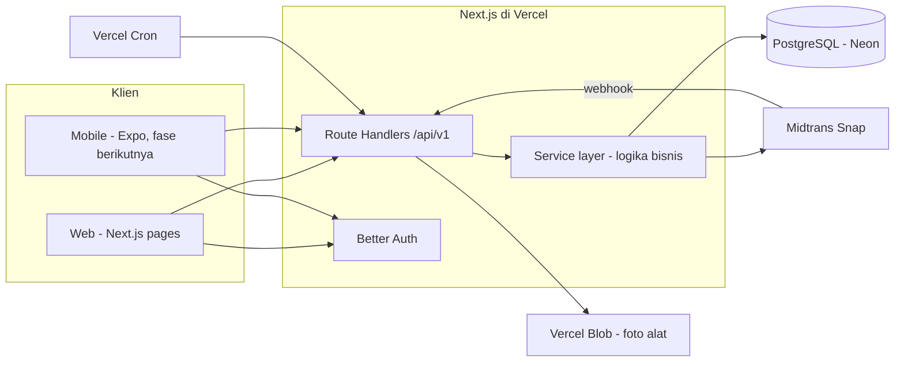

# Penyewaan Alat Hiking

Web aplikasi penyewaan alat hiking untuk satu toko: pelanggan bisa melihat katalog, cek ketersediaan per tanggal, dan menyewa online atau bayar di toko. Admin mengelola alat, kategori, pesanan, sewa walk-in, pengembalian, denda, dan jaminan.

Proyek portofolio yang dibangun API-first (lihat [Arsitektur](#arsitektur)), dengan cakupan test menyeluruh dan sudah deploy ke produksi.

**Demo:** _(isi dengan domain Vercel Anda)_
**Akun demo:**
| Peran | Email | Password |
|---|---|---|
| Admin | lihat environment variable `SEED_ADMIN_EMAIL`/`SEED_ADMIN_PASSWORD` di deployment Anda | — |

## Fitur

**Pelanggan**
- Katalog alat dengan pencarian, filter kategori/harga, dan filter ketersediaan per rentang tanggal.
- Keranjang dengan kalkulasi harga real-time (harga/hari × jumlah hari × jumlah unit).
- Checkout: pilih jaminan (Deposit Uang atau KTP fisik) dan metode bayar (Midtrans Snap online, atau bayar di toko).
- Riwayat pesanan, detail status, dan bayar ulang untuk pesanan yang belum lunas.

**Admin**
- Kelola alat dan kategori (foto, harga, stok, visibilitas publik/internal).
- Kelola pesanan: konfirmasi pembayaran manual, serahkan alat, terima/kembalikan jaminan, batalkan.
- Sewa walk-in: buat pesanan untuk pelanggan yang datang langsung ke toko, termasuk "tambah alat cepat" untuk alat yang belum ada di katalog.
- Pengembalian alat dengan pratinjau denda telat real-time dan penyelesaian jaminan (refund deposit / tagih kekurangan / kembalikan KTP).
- Dashboard: pendapatan, unit tersewa, pengambilan/pengembalian hari ini, pesanan terlambat, 5 alat terpopuler, dengan filter periode.
- Kelola pelanggan: cari pelanggan, lihat riwayat dan total denda.
- Pengaturan toko: grace period, persentase denda, jam operasional, batas waktu bayar.

## Arsitektur



Prinsip utama:
- **API-first** — semua logika bisnis ada di service layer (`src/server/services`), dibuka lewat Route Handlers `/api/v1/*`. Halaman web memanggil service yang sama, jadi mobile app nanti tidak butuh backend baru.
- **Logika murni terpisah** — perhitungan biaya, hari sewa, denda, dan transisi status ditulis sebagai fungsi murni tanpa akses database di `src/lib/domain`, sehingga mudah diuji secara terisolasi.
- **Satu sumber validasi** — skema Zod di `src/lib/validation` dipakai bersama oleh form, API, dan (nanti) mobile.

Detail lengkap ada di [`.kiro/specs/penyewaan-alat-hiking/design.md`](.kiro/specs/penyewaan-alat-hiking/design.md), termasuk skema database, alur checkout/return, dan keputusan implementasi per fitur.

### Stack teknis

| Layer | Pilihan |
|---|---|
| Framework | Next.js 16 (App Router) + TypeScript |
| UI | Tailwind CSS + shadcn/ui, ikon lucide-react |
| Form | react-hook-form + Zod |
| Data fetching klien | TanStack Query |
| State keranjang | Zustand + persist (localStorage) |
| Database | PostgreSQL (Docker lokal / Neon di produksi) |
| ORM | Prisma 7 |
| Auth | Better Auth (email/password + Google opsional) |
| Pembayaran | Midtrans Snap |
| Penyimpanan foto | Folder lokal (dev) / Vercel Blob dengan OIDC (produksi) |
| Tanggal & zona waktu | date-fns + @date-fns/tz (Asia/Jakarta) |
| Test | Vitest — unit (domain) + integrasi (service, butuh Postgres) |
| Deploy | Vercel + Neon, Vercel Cron |

## Setup Lokal

### Prasyarat
- Node.js ≥ 24 (lihat `.nvmrc`)
- Docker Desktop (untuk PostgreSQL lokal)

### Langkah

```bash
# 1. Install dependency
npm install

# 2. Salin dan isi environment variable
cp .env.example .env
# Isi minimal: BETTER_AUTH_SECRET (generate: npx @better-auth/cli secret)
# Nilai DATABASE_URL default sudah cocok dengan docker-compose.yml

# 3. Jalankan PostgreSQL lokal
npm run db:up

# 4. Migrasi + seed data awal (kategori, alat contoh, akun admin)
npm run db:migrate
npm run db:seed

# 5. Jalankan dev server
npm run dev
```

Buka [http://localhost:3000](http://localhost:3000). Login admin dengan `SEED_ADMIN_EMAIL`/`SEED_ADMIN_PASSWORD` dari `.env` (default: `admin@sewahiking.test` / `admin12345`).

### Test

```bash
npm test              # unit test (domain, validasi, utilitas)
npm run test:int      # integration test (service layer, butuh Postgres jalan)
npm run typecheck
npm run lint
npm run build
```

## Deploy ke Produksi

Stack produksi: **Vercel** (hosting + cron + Blob storage) dan **Neon** (PostgreSQL serverless).

1. **Database**: buat project Neon (lewat dashboard Neon, atau Vercel Marketplace di tab Storage project Anda), salin connection string **pooled** ke `DATABASE_URL`.
2. **Foto alat**: buat Blob store di tab Storage project Vercel, pilih akses **Public**. Vercel menghubungkan store lewat OIDC secara otomatis — tidak perlu `BLOB_READ_WRITE_TOKEN` manual (lihat komentar di `src/server/storage.ts`).
3. **Environment variable** di Vercel (Settings → Environment Variables) — isi semua variabel yang ada di `.env.example`, kecuali variabel Blob (otomatis). `NEXT_PUBLIC_APP_URL` dan `BETTER_AUTH_URL` harus domain produksi yang stabil, bukan URL deployment preview.
4. **Migrasi + seed** ke database produksi (dari lokal, dengan `DATABASE_URL` mengarah ke Neon):
   ```bash
   npx vercel link
   npx vercel env pull .env.production.local --environment production
   # jalankan dengan DATABASE_URL dari file itu:
   npx prisma migrate deploy
   npx tsx prisma/seed.ts
   ```
5. **Cron kedaluwarsa pesanan** — sudah terkonfigurasi di `vercel.json` (1x/hari, sesuai limit Vercel Hobby plan). Ketersediaan alat tetap real-time karena dicek ulang setiap ada akses pesanan langsung, tidak menunggu cron.

## Struktur Proyek

```
src/
  app/                    # routes (App Router)
    (public)/             # katalog, detail alat, keranjang
    (customer)/           # checkout, pesanan saya (butuh login)
    (auth)/               # masuk, daftar
    admin/                # panel admin
    api/v1/               # Route Handlers (REST, dipakai web & mobile nanti)
  components/             # komponen UI per area (admin, catalog, checkout, ui/ dari shadcn)
  lib/
    domain/               # logika bisnis murni: pricing, fine, settlement, availability, dst
    validation/           # skema Zod bersama (form + API)
  server/
    services/             # service layer: orkestrasi domain + Prisma
    auth.ts, db.ts, http.ts, storage.ts, midtrans.ts
prisma/
  schema.prisma
  seed.ts
```

## Dokumentasi Lengkap

Proses requirement → design → implementasi bertahap ada di `.kiro/specs/penyewaan-alat-hiking/`:
- [`requirements.md`](.kiro/specs/penyewaan-alat-hiking/requirements.md) — user story dan acceptance criteria.
- [`design.md`](.kiro/specs/penyewaan-alat-hiking/design.md) — arsitektur, skema database, keputusan implementasi per fitur.
- [`tasks.md`](.kiro/specs/penyewaan-alat-hiking/tasks.md) — daftar task implementasi.

## Catatan

- Foto alat pada data seed adalah placeholder (`placehold.co`), bukan foto asli — silakan upload foto sungguhan lewat panel admin.
- Midtrans berjalan di mode sandbox secara default. Untuk transaksi produksi sungguhan, perlu akun Midtrans production yang sudah diverifikasi.
- Proyek ini dibangun sebagai latihan/portofolio dengan bantuan AI pair-programming (Kiro), dengan requirement, keputusan desain, dan review tetap dikendalikan manusia.
